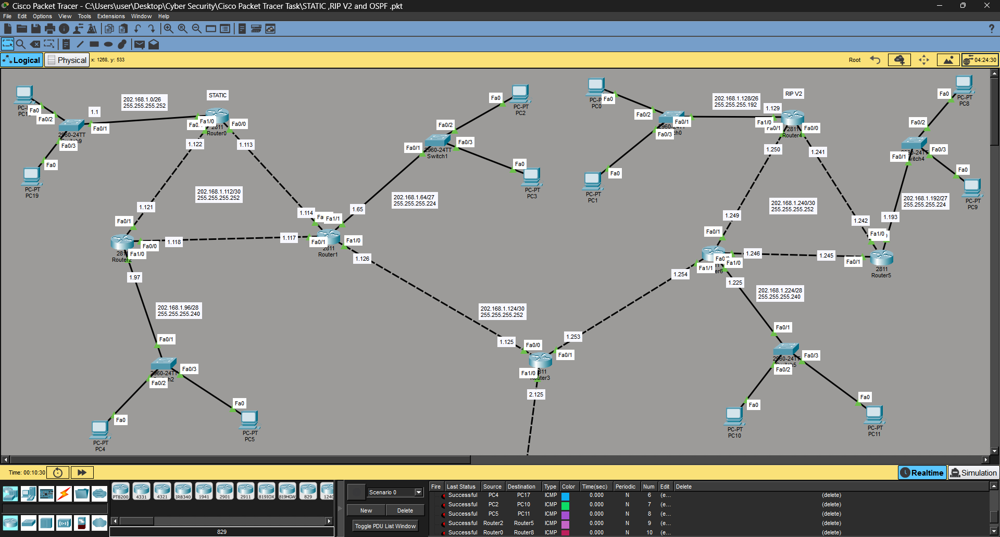
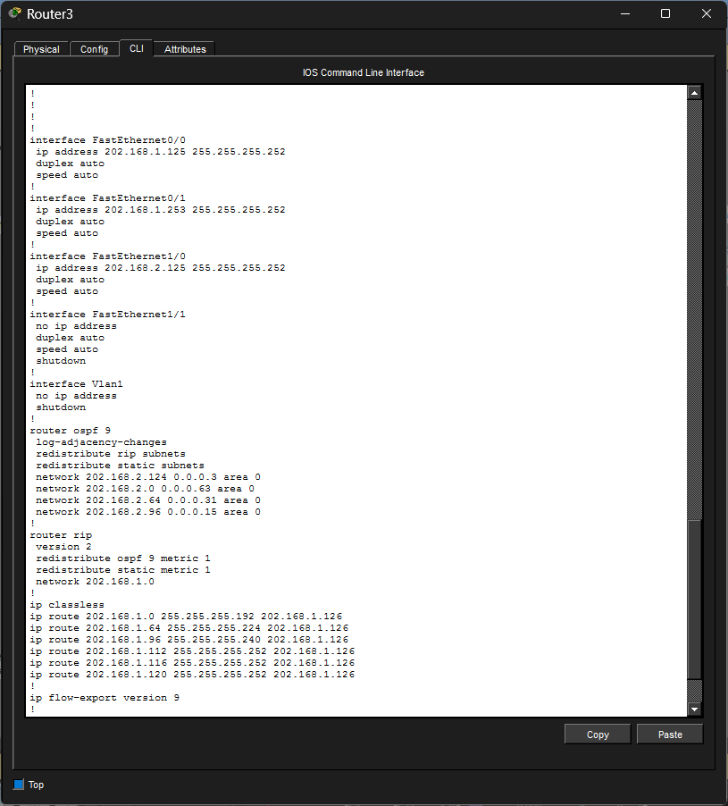

# Multi-Routing Network (Static + RIP v2 + OSPF)

## 📌 Project Overview

This project demonstrates a hybrid enterprise network using multiple routing protocols:

* Static Routing (Left Side)
* RIP v2 (Right Side)
* OSPF (Bottom)

All networks are interconnected using a central router.

## 🛠 Technologies Used

* Cisco Packet Tracer
* Static Routing
* RIP v2
* OSPF
* DHCP Configuration

## 🧩 Network Design

* Each topology contains:

  * 3 Routers
  * 1 Switch per router
  * 2 PCs per switch
* Total multiple subnets using structured design

## ⚙️ Key Features

* DHCP configured on routers for automatic IP assignment
* End-to-End connectivity achieved between all PCs
* Inter-routing between Static, RIP, and OSPF networks
* Scalable enterprise-like topology

## 📸 Screenshots

### Network Topology

### Routing Table

### Ping Test

### Configuration

## 🚀 Outcome

Successfully implemented a multi-protocol routing environment with full connectivity.

## 👨‍💻 Author

Riken Patel
